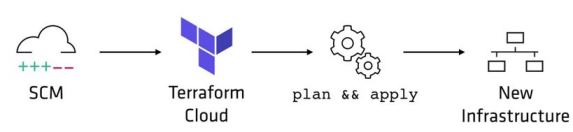
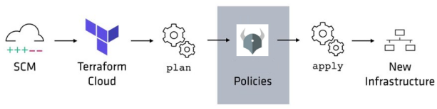
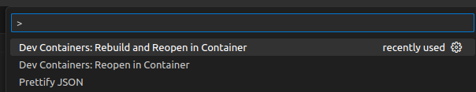

#  Introduction to Open Policy Agent - OPA
[![CC BY-SA 4.0][cc-by-sa-shield]][cc-by-sa]

What is OPA? [The OPA website](https://www.openpolicyagent.org) provides us with the following short introduction:
> The Open Policy Agent (OPA, pronounced “oh-pa”) is an open source, general-purpose policy engine that unifies policy enforcement across the stack. OPA provides a high-level declarative language that lets you specify policy as code and simple APIs to offload policy decision-making from your software. You can use OPA to enforce policies in microservices, Kubernetes, CI/CD pipelines, API gateways, and more.

In this intro, we'll show on few examples suggesting how the OPA can be used to apply the **policy-as-code** method to a CICD pipeline delivering an **infrastructure-as-code** with [Terrafom](https://www.terraform.io/).

Normal operation of a CICD pipeline delivering infrastructure using Terraform:



The same pipeline with OPA:



The OPA policy engine consumes data in the JSON format. So we have to at first convert the Terraform plan to JSON. The Terraform plan is a list of resources that will be created, updated or deleted. The OPA policy engine can then evaluate the plan and decide whether it is allowed to be applied or not.

The Terraform plan in the JSON format we get this way:

```
terraform plan -out plan.tfplan
terraform show -json plan.tfplan > terraform-plan.json
```

Then, we can use the OPA policy engine to evaluate the plan:

```
opa eval --format pretty --data terraform_1.rego -i terraform-plan.json data.terraform
```

**IMPORTANT NOTE:**
This project doesn't include any Terraform artifacts. If you want to try it, you have to create your own Terraform project. But in order to make it easier for you, a sample Terraform plan is included in the [`terraform-plan.json`](terraform-plan.json) file.

## Getting started

This project includes a `devcontainer` with all the necessary tools to run the OPA policy engine. So, you can use the [Visual Studio Code](https://code.visualstudio.com/) to open the project and start the `devcontainer`.
Just press `F1` and type `Dev Containers: Reopen in Container`:



## Running the OPA policy engine as a service

The OPA policy engine can be run as a service, which you can use in your cloud environment:
```
opa run --server
```

But in the `devcontainer` it should be already running. You can check it by opening [http://localhost:8181](http://localhost:8181) in your web browser. You should see a very simplistic web interface.

## Integrating the OPA policy engine service into your applications

The OPA service is accessible through a [REST API](https://www.openpolicyagent.org/docs/latest/rest-api/), so you can integrate it into your applications very easily. In this project, we provide a simple example in Python using the [OPA-python-client library](https://pypi.org/project/opa-python-client/). The following command runs the example client:

```
python3 policy-test.py
```

## Information resources

* [OPA Policy Reference](https://www.openpolicyagent.org/docs/latest/policy-reference/)
* [Rego Cheat Sheet](https://medium.com/@agarwalshubhi17/rego-cheat-sheet-5e25faa6eee8)
* [The Rego Language Playground](https://play.openpolicyagent.org/)
---

This work is licensed under a
[Creative Commons Attribution-ShareAlike 4.0 International License][cc-by-sa].

[![CC BY-SA 4.0][cc-by-sa-image]][cc-by-sa]

[cc-by-sa]: http://creativecommons.org/licenses/by-sa/4.0/
[cc-by-sa-image]: https://licensebuttons.net/l/by-sa/4.0/88x31.png
[cc-by-sa-shield]: https://img.shields.io/badge/License-CC%20BY--SA%204.0-lightgrey.svg
